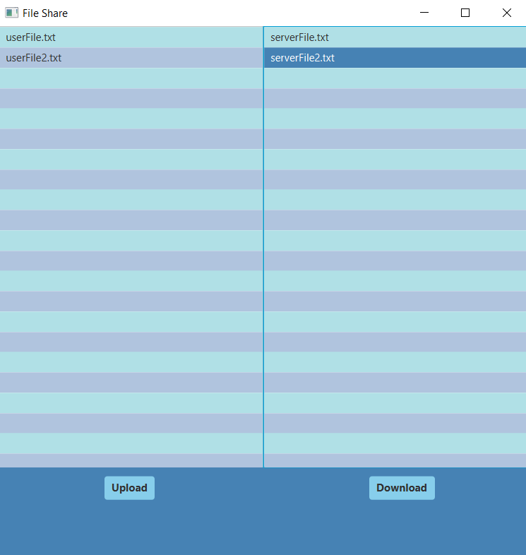

# ricky-shayne-assignment2-csci2020

# Project Information
This program allows a client to utilize a server to transfer files from
client to server and from server to client using download and upload.
The program includes a UI which displays files in both the client and
server directory that can be selected and transferred to either side
using readers and writers.

# Improvements
Some improvements were made such as adding a design rework using
a blue and white colour pallet. This makes the program look more
appealing and the blues used are easy on the eyes.

# How To Run
To use this program yourself you must first open up your cmd or other
similar program such as git bash and locate the folder you would like
to clone to. Secondly, use the command git clone [url] using the url
at the top of this browser page in the place of the bracketed url.
Your system must have a working jdk selected on your IDE of choice as
well as a JavaFX jdk imported properly as a library to be used for the
project. You can then run it through your IDE like IntelliJ and the program
should pop up as a new window. This program requires you to run both the 
server and the ui separately using two different run configurations.
The window allows you to select files on either side and with a button
press can transfer these files.

# Other Resources
https://stackoverflow.com/questions/541487/implements-runnable-vs-extends-thread-in-java

https://docs.oracle.com/javase/7/docs/api/java/io/ObjectInputStream.html

https://docs.oracle.com/javase/7/docs/api/java/io/DataInputStream.html

https://howtodoinjava.com/java/io/read-file-content-into-byte-array/

https://www.javatpoint.com/java-datainputstream-readutf-method#:~:text=The%20readUTF(DataInput%20in)%20method,then%20returned%20as%20a%20String.

https://www.javatpoint.com/java-datainputstream-read-method

